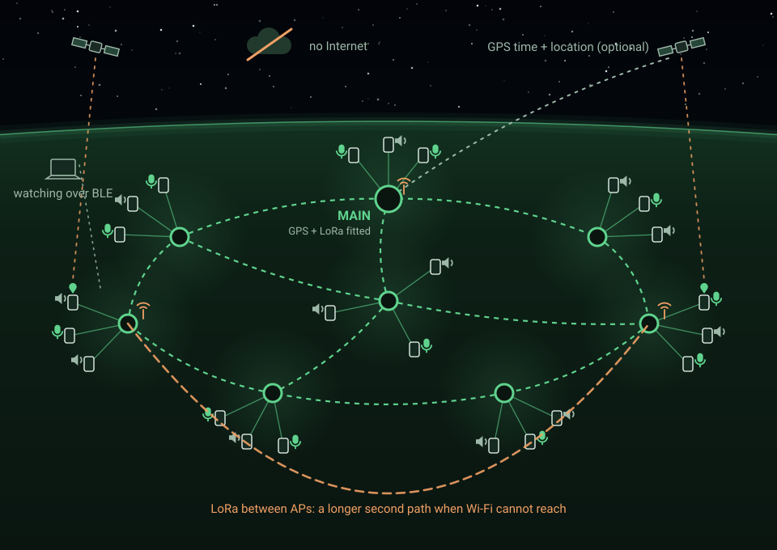

<div align="center">


# LocalGrid

**An offline messaging network built from inexpensive ESP32 boards.**
Access points find each other and form a self-healing network by themselves. Touchscreen handhelds
send text, emergencies and push-to-talk voice across it. No Internet, no phones, no cell service —
ever.

[](docs/chaos-engineering.md)
[](LICENSE)
[](https://docs.espressif.com/projects/esp-idf/en/latest/esp32/get-started/)
[](#status)

[Project site](https://iamankushpandit.github.io/LocalGrid/) ·
[Try the admin page in your browser](https://iamankushpandit.github.io/LocalGrid/admin/) ·
[**How it was chaos tested**](docs/chaos-engineering.md) ·
[Design review](docs/DESIGN_REVIEW.md) ·
[Decisions](docs/DECISIONS.md)

</div>



## What it is

Put a few powered access points around an area with no signal, hand everyone a touchscreen handheld,
and people can message each other. Nobody configures anything after the first setup. It is designed
for the moment the infrastructure everyone relies on is not there.

Three radios, each with a job:

| Radio | Job |
|---|---|
| **Wi-Fi** (ESP-NOW) | Carries normal traffic between access points, and each handheld's link to its access point |
| **LoRa** | A second, much longer link between access points, used when Wi-Fi cannot reach (D71, D74) |
| **Bluetooth** | Lets a laptop or phone watch the network's health without joining it — read-only, never a participant (D68, D70) |

Emergency alerts go out over Wi-Fi **and** LoRa at the same time, so an alert never depends on one
radio being up.

## What it does

- **1:1 messages, end-to-end encrypted** with X25519, HKDF-SHA256 and ChaCha20-Poly1305. Access
  points carry them without being able to read them (D5).
- **Groups and broadcasts**, encrypted in transit, with delivery and read reporting.
- **Emergencies** that break through every screen, including the lock screen (D57, D58).
- **Push-to-talk** to a person or a group, with 100 ms frames sealed like text (D61), and recorded
  voice notes that can travel over LoRa (D72).
- **No single point of failure.** There is no master and no server: every access point holds a full
  replica of the settings, groups, who is online, the network time and the health history. Records
  carry a version, so the newest wins, and they re-announce on link-up and on a timer. Split the
  network in half and rejoin it and it reconciles on its own (D45, D48).
- **Self-healing.** A device that restarts recovers its state from the devices that stayed up. Grid
  time survives a restart and can come from a GPS on an access point (D53, D60, D63).
- **An admin page on every access point** at `http://192.168.4.1/` to name the network, manage people
  and groups, and set the time.
- **Positions on a map.** A handheld with a GPS shares its position, held in memory only, so the
  admin page can show where people are (D65).
- **Bounded by design.** Fixed-size tables, no heap allocation per message, and a defined, logged
  result when anything fills up.

## Tested by breaking it

LocalGrid's core claim is that it heals itself. That claim was tested by attacking it: a framework
that randomly kills access points and handhelds, cuts their power and switches their radios off, for
hours at a time, unattended, while the handhelds keep messaging each other — then measures how long
everything took to come back and whether anything was lost.

**In the 10-hour run of 2026-09-18: 55 faults injected, 55 recovered, none needing a human. The
backbone re-formed in a median of 3.7 s. No crash, watchdog or brownout the framework had not caused.**

It also found three bugs that code review and unit tests never could:

| Bug | Why only chaos found it |
|---|---|
| A use-after-free behind a message banner | Every crash report pointed at the memory allocator, in a different thread each time — accurate, and useless. It only triggered when two messages arrived more than 15 s apart. |
| A restarted access point refusing valid messages | Presence was announced on join but never repeated, so a node that restarted came back knowing nobody. 44 refusals in one night, with no error logged anywhere. |
| The self-healing promise not being true | With every access point down at once the network lost its time, and the code meant to restore it could never have worked. The test harness had been hiding this by setting the clock itself. |

**→ [The full story: how it was chaos tested, and what it still cannot find](docs/chaos-engineering.md)**
· [the run's own report](docs/chaos/2026-09-18-night-run.md)

## Status

> **Prototype.** It runs on the bench boards every day and changes fast. Read
> [the milestone reports](docs/milestones/) before relying on any part of it.

**Working now:** the protocol core, access point firmware with the admin page, handheld firmware on
six display boards, encryption, groups, emergencies, push-to-talk, the LoRa backbone, GPS time and
positions, the Bluetooth watchers, and the chaos framework.

**Not done yet:**

- **Purpose-built handhelds.** The GPS and LoRa handheld hardware is still being designed; today's
  handhelds are development boards with modules wired on.
- **Enclosures.** The access points have no cases yet.
- **Field testing.** Every test so far has run on one workbench with every board in radio range and
  on a cable. Chaos testing in the field — devices spread out, on batteries, no wires — is planned,
  and needs a way to inject faults remotely. The
  [chaos write-up](docs/chaos-engineering.md#what-is-next-chaos-in-the-field) sets out the approach.
- **Measured ranges.** The distances on the project site are estimates, not measurements.
- **No binaries are published.** A built image carries the network's compiled-in keys, so downloads
  wait until keys are provisioned at runtime (see [docs/OPEN_SOURCE.md](docs/OPEN_SOURCE.md)).

## Hardware

| Board | Chip | Role |
|---|---|---|
| Elegoo ESP32 dev board (or any 4 MB ESP32) | ESP32 | Access point |
| Hosyond 3.2in display (ST7789P3, resistive touch) | ESP32 | Handheld |
| Freenove FNK0104B 2.8in (ILI9341, capacitive touch, mic, speaker, PSRAM) | ESP32-S3 | Handheld |
| LCDWIKI E32R28T-1 2.8in (ILI9341, XPT2046 touch, speaker) | ESP32 | Handheld |
| ESP32-2432S028 2.8in "CYD" (ILI9341, XPT2046 touch, speaker) | ESP32 | Handheld |
| LCDWIKI E32R40T 4.0in (ST7796 320x480, XPT2046 touch, speaker) | ESP32 | Handheld |
| Waveshare ESP32-C6-LCD-1.47 and its touch variant | ESP32-C6 | Alert and distress unit (D66) |
| GT-U7 GPS module (u-blox 7 class), optional | UART | Network time and location (D63, D64, D65) |
| Reyax RYLR998 LoRa module (SX1262), optional | UART | The second, longer link between access points (D71) |

Board facts live in data-only profiles in [`components/lg_board`](components/lg_board). A new display
board is often a profile and a touch check away — see
[CONTRIBUTING.md](CONTRIBUTING.md#port-a-board) and [docs/BOARDS.md](docs/BOARDS.md). Every module is
optional: with no GPS an admin sets the time, and with no LoRa the access points use Wi-Fi alone.
Nothing else changes.

## Build it

LocalGrid uses pure ESP-IDF v6.1 (D1): no Arduino, no PlatformIO.

1. Install [ESP-IDF v6.1](https://docs.espressif.com/projects/esp-idf/en/latest/esp32/get-started/)
   with targets `esp32`, `esp32s3` and `esp32c6`, and load its environment.
2. Generate your network's keys. Every device in one network must be built from the same file, so
   keep it:
   ```bash
   python tools/gen_secrets.py
   ```
3. Build every firmware type for every target, with warnings refused:
   ```bash
   python tools/build.py
   ```
4. Put your boards in [`tools/bench_devices.json`](tools/bench_devices.json) and flash them. The tool
   checks each board's device ID before it writes anything:
   ```bash
   python tools/flash.py --all
   ```
5. Flash `tests` to any board and look for `LG_TESTS_RESULT: PASS`. It runs the protocol core's unit
   tests, the RFC crypto vectors, and a simulated three-node network on the chip.

Then join the network's Wi-Fi from a laptop or phone and open `http://192.168.4.1/` to set it up.

## Repository layout

| Path | What |
|---|---|
| `components/lg_core` | Portable C11 protocol core: envelope, IDs, dedup, routing, handheld logic |
| `components/lg_crypto` | The only crypto interface (PSA Crypto backend) |
| `components/lg_board`, `lg_bsp`, `lg_draw` | Board profiles, drivers, and the handheld renderer |
| `components/lg_selftest` | The checks every handheld runs at boot (D24) |
| `firmware/node` | Access point firmware, including the admin page |
| `firmware/handheld` | Handheld firmware: network service and screens |
| `tests/target` | On-board test app with a simulated three-node network |
| `tools/` | Build, flash, serial capture, chaos testing, and site generation |
| `docs/` | Design review, decisions, milestone reports, the chaos write-up |

[AGENTS.md](AGENTS.md) has the rules the code follows. Read it before your first change.

## Contributing

Contributions are welcome, especially board ports, testing on your own radios, and the admin page.
Start with [CONTRIBUTING.md](CONTRIBUTING.md). Report security problems privately as described in
[SECURITY.md](SECURITY.md). Everyone taking part agrees to the
[Code of Conduct](CODE_OF_CONDUCT.md).

## Licence

GNU General Public License v3 or later (`GPL-3.0-or-later`) — see [LICENSE](LICENSE). The same
licence as [Braino](https://github.com/iamankushpandit/Gume), so work can move between the two
projects. Third-party material keeps its own licence, listed in [THIRD_PARTY.md](THIRD_PARTY.md);
the reasoning behind the choice is in [docs/OPEN_SOURCE.md](docs/OPEN_SOURCE.md).
